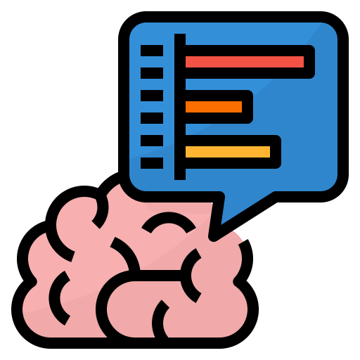

<h1 color="black" align="center"> #Hi Stranger :alien:🖖 </h1>

Welcome to my GitHub! :octocat:

    
    
    
    

<h2 align='left'>👨🏻‍💻 #About me:</h2>

I'm Gabriel Vieira 👨‍🚀,  Beginner backend Developer 💻   and I love helping people through technology! ❤️.

---

    <h2 align="rigth"></img>#My Skills: </h2>

    
    
    
    
    
    
    
    
    
    
    
    
    
    
    
    
    <a href="https://github.com/">
    
    
    
    </a>
    
    
    

---
<h2 align='left'>✨ #Hobbies:</h2>

- 📚 Fantasy books;
- 🎮 Games;
- 🏃‍♂️ Running;
- 🎧 Listening to good music;
- 🎬 Watch Movies and TV Shows;
- 🧟 Turning nights studying

---

> *"Para pessoas como nós não existem coisas como modelos. Somos convocados constantemente a criar nossos modelos."* - Ousmane Sembene
