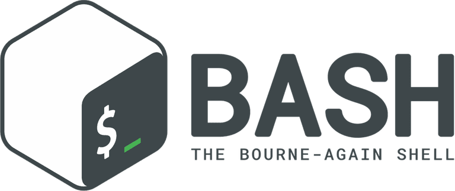

## 👨🏻‍💻 Gabriel Vieira
<!--
**gabrielvieira1/gabrielvieira1** is a ✨ _special_ ✨ repository because its `README.md` (this file) appears on your GitHub profile.

Here are some ideas to get you started:

- 🔭 I’m currently working on ...
- 🌱 I’m currently learning ...
- 👯 I’m looking to collaborate on ...
- 🤔 I’m looking for help with ...
- 💬 Ask me about ...
- 📫 How to reach me: ...
- 😄 Pronouns: ...
- ⚡ Fun fact: ...
-->

---
 

    
    
    

### Oops, everything okay?

<h6 align="left">
    My name is Gabriel Vieira, I am majoring in Computer Science and I love helping people through technology!
</h6>

### 🛠 Technologies

Technologies and tools I know:

    
    
    
    
    
    
    
     
    
    
    
    

Technologies and tools that I am learning at the moment:
    

     
     
     
    
    

---
#### 🚧 What I'm looking for
- Looking for a job as an information security analyst and Frontend or Backend developer;
- Collaborate in a project;
- Freelance projects;
- To join a Hackaton team to improve my basic skills;
- To grow with the support of the community.

---
#### 💬 Languages(Learning)

- English - Intermediate;
- Portuguese - Native.

---
#### ⚡ Hobbies

- 📚 Fantasy books;
- 🎮 RPG games(Paladins);
- 🎧 Listening to good music;
- 🎬 Watch Movies and TV Shows;
- 🧟 Turning nights studying

---

> *"A ciência da computação não é mais sobre computadores, da mesma forma que a astronomia não é mais sobre telescópios."* - E. W. Dijkstra
